# Implementation Plan: PeoplePay360 - HR & Payroll Platform

**Project Name**: PeoplePay360: HR & Payroll  
**Context**: Odoo Hackathon - Integrated Human Resource and Payroll Operations Platform  
**Target Repository**: `c:\Users\patel\Desktop\odoo`  
**Chosen Tech Stack**:  
- **Frontend**: **Next.js 14+ (App Router, React 18/19, TypeScript)** + **Tailwind CSS** + **Shadcn UI (Radix Primitives)** + **Three.js / React Three Fiber (`@react-three/fiber`, `@react-three/drei`)** + **Framer Motion** + **Recharts** + **Lucide Icons**  
- **Backend API**: **Python (FastAPI + Pydantic v2 + Uvicorn)**  
- **Database**: **MongoDB (Async Driver via Motor / Beanie ODM)**  
- **Dynamic Rule Engine**: **Python AST / `asteval` (Safe Dynamic Expression Evaluator)**  
- **PDF Generation**: **WeasyPrint (HTML+CSS to High-Res PDF)**  
- **Bulk Email Engine**: **FastAPI BackgroundTasks + FastAPI-Mail / aiosmtplib**  

---

## 1. Executive Summary & Problem Analysis

### 1.1 The Core Problem & Hackathon Challenge
Basic HR software isolates employee master data, attendance tracking, leave requests, and payroll into detached tables. PeoplePay360 solves this by unifying the entire employee lifecycle into an interconnected operational workflow:

1. **Centralized Employee Hub**: The Employee record acts as the operational hub with **Smart Buttons (Live Counters)** linking directly to filtered Contracts, Attendance, Time Off, and Allocations.
2. **Temporal Contract Management**: Employees have multiple historical contracts. Payroll must dynamically resolve and bind **only the contract actively running during the payroll period**, while strictly forbidding concurrent active contracts.
3. **Working Schedule Auto-Calculation**: Schedules capture 7-day patterns (Start Time, End Time, Break Duration). The system calculates total weekly hours automatically without manual user input.
4. **Time Off Allocation & Auto-Deduction**: Leaves require allocated balances and HR approval. When a request is approved, balance is automatically deducted in real time. Unpaid leaves feed directly into payroll deductions.
5. **Dynamic Salary Rule Sequencing**: Configurable salary structures contain rules ordered by `sequence`. Rules execute sequentially (`BASIC` -> `ALLOWANCES` -> `GROSS` -> `DEDUCTIONS` -> `NET`), where downstream rules compute values from upstream results using fixed amounts, percentages, or mathematical Python expressions.
6. **Two-Step Payrun Creation Wizard**: Creating a Payrun launches a 2-step setup wizard:
   - **Step 1 (Scope)**: Define Name, Salary Structure, and Period.
   - **Step 2 (Selection)**: The system filters staff with active contracts for that period; the user explicitly selects employees to include.
7. **Pre-Validation Warnings**: Audits payslips for missing bank details, overlapping duplicate payslips, zero attendance, or contract anomalies before validation.
8. **Printable Payslip PDF & Bulk Email**: Single-click corporate PDF generation and asynchronous bulk email delivery to all employees.
9. **Interactive 3D Real-time Payroll Dashboard**: Live KPI cards, departmental cost charts, net salary trends, and an interactive **Three.js 3D organizational network / globe visualizer** to captivate hackathon evaluators.

---

## 2. Full Architecture & Tech Stack Details

```mermaid
graph TD
    subgraph Frontend_NextJS ["Frontend: Next.js 14+ (App Router & React 18/19)"]
        UI_Shell["Enterprise Shell & Top Nav"]
        ThreeCanvas["Three.js Interactive 3D Canvas (R3F)"]
        EmpHub["Employee Hub (Kanban / List / Form)"]
        SmartBtns["Smart Buttons (Contracts, Attendance, Time Off)"]
        AttGrid["Attendance & Exception Correction Hub"]
        TimeOffMgt["Time Off Requests & Allocation Balances"]
        RuleConfig["Salary Structures & Sequential Rule Config"]
        PayrunWizard["Two-Step Payrun Creation Wizard"]
        PayrunHub["Payrun Processing (Compute, Validate, Pay)"]
        PayslipDetail["Detailed Payslip & Computed Line Breakdown"]
        DashCharts["Recharts Live Dashboard & Filters"]
    end

    subgraph Backend_FastAPI ["Backend: Python FastAPI (Asynchronous)"]
        AuthRouter["/api/v1/auth (RBAC JWT & Roles)"]
        EmpRouter["/api/v1/employees (Master Data & Smart Counts)"]
        ContractRouter["/api/v1/contracts (Temporal Period Overlap Guard)"]
        ScheduleRouter["/api/v1/schedules (Auto Weekly Hours)"]
        AttRouter["/api/v1/attendance (Check-in/out & Exceptions)"]
        LeaveRouter["/api/v1/time-off (Atomic Allocations & Approvals)"]
        PayrollRouter["/api/v1/payroll (Structures, Rules, Payruns)"]
        
        subgraph Internal_Engines ["Core Engines"]
            RuleEngine["Python AST / asteval Rule Evaluator"]
            WarningEngine["Pre-Payroll Sanity & Warning Audit"]
            PDFService["WeasyPrint PDF Generator"]
            EmailService["FastAPI BackgroundTasks Mailer"]
        end
    end

    subgraph Database_MongoDB ["Database: MongoDB (Motor / Beanie ODM)"]
        Col_Users[("users")]
        Col_Employees[("employees")]
        Col_Contracts[("contracts")]
        Col_Schedules[("schedules")]
        Col_Attendance[("attendances")]
        Col_TimeOff[("time_off_types & allocations & requests")]
        Col_SalaryConfig[("salary_structures & rules")]
        Col_Payruns[("payruns")]
        Col_Payslips[("payslips (with embedded lines)")]
    end

    Frontend_NextJS <-->|REST API JSON / CORS| Backend_FastAPI
    Backend_FastAPI <-->|Async Motor Driver| Database_MongoDB
    PayrollRouter --> RuleEngine
    PayrollRouter --> WarningEngine
    PayrollRouter --> PDFService
    PayrollRouter --> EmailService
```



### Why This Stack Excels in the Odoo Hackathon:
1. **FastAPI (Python)**: Matches Odoo's native Python core. Python is the gold standard for dynamic rule formula evaluation (`contract.wage * 0.40`), clean async architecture, and auto-generated Swagger UI (`/docs`) for live judge demonstrations.
2. **MongoDB**: Allows **Embedded Payslip Lines** within the `Payslip` document. Unlike SQL where 50 payslips with 10 rules require 500 row joins, MongoDB retrieves each complete payslip in a single atomic document read!
3. **Next.js 14+ & Tailwind CSS + Shadcn UI**: Delivers a hyper-polished, responsive ERP interface matching Odoo's UX standards.
4. **Three.js (`@react-three/fiber` & `@react-three/drei`)**: Adds interactive 3D visual elements (e.g. an interactive 3D organizational network or payroll sphere on the dashboard/landing page) that elevate the presentation and stand out against ordinary CRUD projects.

---

## 3. MongoDB Schema & Beanie Document Models

```python
# backend/app/models/schemas.py
from datetime import datetime, date
from typing import List, Optional, Dict, Any
from enum import Enum
from pydantic import BaseModel, EmailStr, Field
from beanie import Document, Indexed, Link

# ==========================================
# 1. ENUMS
# ==========================================
class UserRole(str, Enum):
    EMPLOYEE = "EMPLOYEE"
    HR_MANAGER = "HR_MANAGER"
    HR_PAYROLL_USER = "HR_PAYROLL_USER"
    HR_PAYROLL_MANAGER = "HR_PAYROLL_MANAGER"
    ADMIN = "ADMIN"

class EmployeeStatus(str, Enum):
    ACTIVE = "ACTIVE"
    INACTIVE = "INACTIVE"
    ON_LEAVE = "ON_LEAVE"
    TERMINATED = "TERMINATED"

class EmploymentType(str, Enum):
    FULL_TIME = "FULL_TIME"
    PART_TIME = "PART_TIME"
    CONTRACT = "CONTRACT"
    INTERN = "INTERN"

class ContractStatus(str, Enum):
    DRAFT = "DRAFT"
    RUNNING = "RUNNING"
    EXPIRED = "EXPIRED"
    CANCELLED = "CANCELLED"

class AttendanceStatus(str, Enum):
    PRESENT = "PRESENT"
    LATE = "LATE"
    EARLY_DEPARTURE = "EARLY_DEPARTURE"
    ABSENT = "ABSENT"
    HALF_DAY = "HALF_DAY"
    OVERTIME = "OVERTIME"

class LeaveUnit(str, Enum):
    DAYS = "DAYS"
    HOURS = "HOURS"

class TimeOffRequestStatus(str, Enum):
    DRAFT = "DRAFT"
    PENDING = "PENDING"
    APPROVED = "APPROVED"
    REFUSED = "REFUSED"
    CANCELLED = "CANCELLED"

class RuleCategory(str, Enum):
    BASIC = "BASIC"
    ALLOWANCE = "ALLOWANCE"
    GROSS = "GROSS"
    DEDUCTION = "DEDUCTION"
    COMPANY_CONTRIBUTION = "COMPANY_CONTRIBUTION"
    NET = "NET"

class ComputationType(str, Enum):
    FIXED = "FIXED"
    PERCENTAGE = "PERCENTAGE"
    FORMULA = "FORMULA"

class PayrunStatus(str, Enum):
    DRAFT = "DRAFT"
    COMPUTED = "COMPUTED"
    VALIDATED = "VALIDATED"
    PAID = "PAID"
    CANCELLED = "CANCELLED"

# ==========================================
# 2. EMBEDDED SUB-DOCUMENTS
# ==========================================
class ScheduleDayPattern(BaseModel):
    day_of_week: str       # "MONDAY", "TUESDAY", etc.
    is_active: bool = True
    start_time: str        # "09:00"
    end_time: str          # "18:00"
    break_duration_mins: int = 60
    day_hours: float       # Computed: (18 - 9) - 1 = 8.0 hrs

class BankDetails(BaseModel):
    bank_name: Optional[str] = None
    account_number: Optional[str] = None
    ifsc_or_swift: Optional[str] = None
    pan_or_tax_id: Optional[str] = None

class PayslipLineEmbedded(BaseModel):
    rule_code: str         # "BASIC", "HRA", "PF", "NET"
    rule_name: str
    category: RuleCategory
    sequence: int
    rate: Optional[float] = None
    amount: float
    calculation_note: Optional[str] = None

# ==========================================
# 3. BEANIE MONGODB DOCUMENTS
# ==========================================
class User(Document):
    email: Indexed(EmailStr, unique=True)
    password_hash: str
    role: UserRole = UserRole.EMPLOYEE
    employee_id: Optional[str] = None
    created_at: datetime = Field(default_factory=datetime.utcnow)

    class Settings:
        name = "users"

class Department(Document):
    name: Indexed(str, unique=True)
    code: Indexed(str, unique=True)
    manager_id: Optional[str] = None

    class Settings:
        name = "departments"

class JobPosition(Document):
    title: Indexed(str, unique=True)
    department_id: Optional[str] = None

    class Settings:
        name = "job_positions"

class WorkingSchedule(Document):
    name: Indexed(str, unique=True) # "Standard 40 Hours"
    schedule_type: str = "STANDARD_40H"
    weekly_hours: float = 40.0 # Auto-calculated
    patterns: List[ScheduleDayPattern] = []

    class Settings:
        name = "working_schedules"

class Employee(Document):
    employee_code: Indexed(str, unique=True) # "EMP001"
    first_name: str
    last_name: str
    email: Indexed(EmailStr, unique=True)
    phone: Optional[str] = None
    avatar_url: Optional[str] = None
    status: EmployeeStatus = EmployeeStatus.ACTIVE
    employment_type: EmploymentType = EmploymentType.FULL_TIME
    
    department_id: str
    job_position_id: str
    manager_id: Optional[str] = None
    working_schedule_id: Optional[str] = None
    bank_details: BankDetails = Field(default_factory=BankDetails)
    
    created_at: datetime = Field(default_factory=datetime.utcnow)

    class Settings:
        name = "employees"

class Contract(Document):
    contract_code: Indexed(str, unique=True) # "CON-2026-001"
    employee_id: Indexed(str)
    department_id: str
    job_position_id: str
    start_date: datetime
    end_date: Optional[datetime] = None
    status: ContractStatus = ContractStatus.DRAFT
    wage: float # Monthly base salary
    salary_structure_id: str
    working_schedule_id: Optional[str] = None
    created_at: datetime = Field(default_factory=datetime.utcnow)

    class Settings:
        name = "contracts"

class Attendance(Document):
    employee_id: Indexed(str)
    date: Indexed(datetime) # Date of attendance
    check_in: datetime
    check_out: Optional[datetime] = None
    worked_hours: float = 0.0
    status: AttendanceStatus = AttendanceStatus.PRESENT
    is_manual_edit: bool = False
    manual_edit_note: Optional[str] = None
    edited_by_user_id: Optional[str] = None

    class Settings:
        name = "attendances"

class TimeOffType(Document):
    name: Indexed(str, unique=True) # "Paid Time Off", "Sick Leave"
    code: Indexed(str, unique=True) # "PTO", "SICK", "UNPAID"
    unit: LeaveUnit = LeaveUnit.DAYS
    requires_allocation: bool = True
    is_paid: bool = True # If False, triggers unpaid deduction
    color_code: str = "#3B82F6"

    class Settings:
        name = "time_off_types"

class TimeOffAllocation(Document):
    employee_id: Indexed(str)
    time_off_type_id: Indexed(str)
    allocated_units: float # e.g. 20.0
    taken_units: float = 0.0
    remaining_units: float # allocated_units - taken_units
    valid_from: datetime
    valid_to: datetime
    status: str = "APPROVED" # "DRAFT", "APPROVED", "REFUSED"
    approved_by: Optional[str] = None

    class Settings:
        name = "time_off_allocations"

class TimeOffRequest(Document):
    employee_id: Indexed(str)
    time_off_type_id: Indexed(str)
    start_date: datetime
    end_date: datetime
    duration_units: float
    reason: Optional[str] = None
    status: TimeOffRequestStatus = TimeOffRequestStatus.PENDING
    approved_by: Optional[str] = None
    refusal_reason: Optional[str] = None

    class Settings:
        name = "time_off_requests"

class SalaryRule(Document):
    structure_id: Indexed(str)
    name: str # "Basic Salary", "HRA"
    code: Indexed(str) # "BASIC", "HRA", "GROSS", "PF", "NET"
    category: RuleCategory
    sequence: int # 10, 20, 30...
    computation_type: ComputationType = ComputationType.PERCENTAGE
    fixed_amount: Optional[float] = None
    percentage: Optional[float] = None
    percentage_base_code: Optional[str] = None
    formula_expression: Optional[str] = None # e.g. "contract.wage * 0.40"
    active: bool = True

    class Settings:
        name = "salary_rules"

class SalaryStructure(Document):
    name: Indexed(str, unique=True)
    code: Indexed(str, unique=True)
    description: Optional[str] = None
    active: bool = True

    class Settings:
        name = "salary_structures"

class Payrun(Document):
    name: str # "March 2026 Regular Payroll"
    period_start: datetime
    period_end: datetime
    salary_structure_id: str
    status: PayrunStatus = PayrunStatus.DRAFT
    selected_employee_ids: List[str] = []
    
    total_employees: int = 0
    total_gross: float = 0.0
    total_deductions: float = 0.0
    total_net: float = 0.0
    created_at: datetime = Field(default_factory=datetime.utcnow)

    class Settings:
        name = "payruns"

class Payslip(Document):
    payslip_number: Indexed(str, unique=True) # "SLIP/2026/03/001"
    payrun_id: Indexed(str)
    employee_id: Indexed(str)
    contract_id: str
    period_start: datetime
    period_end: datetime
    status: str = "DRAFT" # "DRAFT", "COMPUTED", "VALIDATED", "PAID"
    
    worked_days: float = 0.0
    unpaid_leave_days: float = 0.0
    
    basic_salary: float = 0.0
    gross_salary: float = 0.0
    total_deductions: float = 0.0
    net_salary: float = 0.0
    
    warnings: List[str] = []
    lines: List[PayslipLineEmbedded] = [] # Embedded directly in document!
    created_at: datetime = Field(default_factory=datetime.utcnow)

    class Settings:
        name = "payslips"
```

---

## 4. Algorithmic Rules & Calculation Logic

### 4.1 Temporal Contract Validation Algorithm (MongoDB Query)
```python
# Check period overlap and ensure NO concurrent active contracts
async def get_active_contract_for_period(employee_id: str, period_start: datetime, period_end: datetime):
    query = {
        "employee_id": employee_id,
        "status": "RUNNING",
        "start_date": {"$lte": period_end},
        "$or": [
            {"end_date": None},
            {"end_date": {"$gte": period_start}}
        ]
    }
    contracts = await Contract.find(query).to_list()
    if len(contracts) > 1:
        raise ValueError(f"Concurrency Error: Employee has {len(contracts)} active contracts overlapping the period.")
    return contracts[0] if contracts else None
```

### 4.2 Weekly Working Hours Auto-Calculation
```python
def calculate_weekly_hours(patterns: List[ScheduleDayPattern]) -> float:
    total_hours = 0.0
    for p in patterns:
        if not p.is_active:
            continue
        start_h, start_m = map(int, p.start_time.split(":"))
        end_h, end_m = map(int, p.end_time.split(":"))
        duration_minutes = (end_h * 60 + end_m) - (start_h * 60 + start_m) - p.break_duration_mins
        day_h = max(0.0, duration_minutes / 60.0)
        p.day_hours = round(day_h, 2)
        total_hours += day_h
    return round(total_hours, 2)
```

### 4.3 Python Safe Rule Expression Evaluator (AST Sandbox)
```python
from asteval import Interpreter

def evaluate_salary_rules(contract_wage: float, worked_days: float, unpaid_days: float, rules: List[SalaryRule]) -> List[PayslipLineEmbedded]:
    # Sorted by execution sequence
    sorted_rules = sorted(rules, key=lambda r: r.sequence)
    
    aeval = Interpreter()
    # Injected context variables
    context = {
        "contract": {"wage": contract_wage},
        "worked_days": worked_days,
        "unpaid_days": unpaid_days,
        "total_days": 22.0,
        "rules": {}
    }
    aeval.symtable.update(context)
    
    lines = []
    for rule in sorted_rules:
        amount = 0.0
        note = ""
        
        if rule.computation_type == ComputationType.FIXED:
            amount = rule.fixed_amount or 0.0
            note = f"Fixed ₹{amount}"
        elif rule.computation_type == ComputationType.PERCENTAGE:
            base_val = context["rules"].get(rule.percentage_base_code, contract_wage)
            pct = (rule.percentage or 0.0) / 100.0
            amount = round(base_val * pct, 2)
            note = f"{rule.percentage}% of {rule.percentage_base_code or 'Wage'} (₹{base_val})"
        elif rule.computation_type == ComputationType.FORMULA:
            # Safe evaluation in AST sandbox
            amount = float(aeval(rule.formula_expression))
            note = f"Formula: {rule.formula_expression}"
            
        context["rules"][rule.code] = amount
        aeval.symtable["rules"][rule.code] = amount
        
        lines.append(PayslipLineEmbedded(
            rule_code=rule.code,
            rule_name=rule.name,
            category=rule.category,
            sequence=rule.sequence,
            rate=rule.percentage,
            amount=amount,
            calculation_note=note
        ))
        
    return lines
```

---

## 5. Three.js Integration Plan (Elevating the Hackathon Project)

To give PeoplePay360 an edge over ordinary web apps, we integrate **Three.js (`@react-three/fiber` & `@react-three/drei`)** in targeted, high-impact areas:

1. **Dashboard 3D Organization & Attendance Sphere**:
   - A smooth 3D globe / particle sphere reflecting global active departments and live employee check-in status with glowing pulsing points.
2. **Interactive 3D Payroll Distribution Visualizer**:
   - A floating 3D bar/pillar chart or glassmorphic coin flow depicting monthly disbursement trends that users can rotate with their mouse.
3. **Login / Welcome Screen 3D Mesh**:
   - A modern, interactive wave/geometry background that reacts subtly to mouse movement.

---

## 6. Comprehensive Task & Mini-Task Breakdown

```
Phase 1: Dual-Stack Setup & Infrastructure (FastAPI + MongoDB + Next.js + Three.js)
  ├── Task 1.1: FastAPI Backend & MongoDB Setup
  ├── Task 1.2: Next.js 14+ Frontend with Tailwind, Shadcn UI & Three.js Canvas
  ├── Task 1.3: Role-Based Authentication & Session Handling
  └── Task 1.4: Enterprise Shell Layout & Main Navigation

Phase 2: Master Data & Configurations (Backend Models + Frontend Views)
  ├── Task 2.1: Employee Master Hub (Kanban, List, Form & Smart Buttons)
  ├── Task 2.2: Working Schedule Builder & Automated Weekly Hour Calculator
  ├── Task 2.3: Contract Management with Temporal Period-Overlap Guard
  └── Task 2.4: Time Off Types & Allocation Balances Setup

Phase 3: Operational HR Tracking (Attendance & Leaves)
  ├── Task 3.1: Attendance System (Check-in/out, Lates, Half-days & Manual Audits)
  └── Task 3.2: Time Off Requests Lifecycle & Atomic Balance Consumption

Phase 4: Salary Configuration & Dynamic Python AST Rule Engine
  ├── Task 4.1: Salary Rules & Categorization
  ├── Task 4.2: Salary Structure Sequencing Container
  └── Task 4.3: Safe AST Formula Evaluator & Test Suite

Phase 5: Operational Payrun Workflow & Payslip Generation
  ├── Task 5.1: Two-Step Payrun Creation Wizard (Scope -> Employee Selection)
  ├── Task 5.2: Payrun Processing Hub (Compute, Validate, Mark Paid)
  ├── Task 5.3: Pre-Payroll Sanity Audit & Warning Badges
  └── Task 5.4: Detailed Payslip View & Line Item Breakdown

Phase 6: High-Fidelity PDF Generation, Bulk Email Delivery & Archival
  ├── Task 6.1: WeasyPrint Corporate Payslip PDF Generator
  ├── Task 6.2: BackgroundTasks Asynchronous Bulk Email Dispatcher
  └── Task 6.3: Historical Payroll Archival & Read-Only Locks

Phase 7: Real-Time Payroll Analytics Dashboard & 3D Visualizer
  ├── Task 7.1: Live KPI Summary Cards & Attendance Health Tracker
  ├── Task 7.2: Department Expenditure & Trend Charts (Recharts)
  ├── Task 7.3: Interactive Three.js 3D Attendance / Payroll Visualizer
  └── Task 7.4: Multi-Dimensional Filter Bar (Period, Department, Employee Type)

Phase 8: Seeding, Verification, Live Demo Scenarios & Pitch Deliverables
  ├── Task 8.1: Realistic Seed Data Generation Script (MongoDB)
  ├── Task 8.2: Live Demo Scenario 1: Employee-to-Payslip Walkthrough
  ├── Task 8.3: Live Demo Scenario 2: Leave-to-Allocation Walkthrough
  └── Task 8.4: Documentation, Postman / Swagger Collection & Pitch Deck
```

---

### Detailed Task Specifications

#### Phase 1: Dual-Stack Setup & Infrastructure

##### Task 1.1: FastAPI Backend & MongoDB Setup
- **Mini-task 1.1.1**: Initialize Python virtual environment (`venv`) and install `fastapi`, `uvicorn[standard]`, `beanie`, `motor`, `pydantic`, `asteval`, `weasyprint`, `fastapi-mail`, `python-jose`, `passlib[bcrypt]`.
- **Mini-task 1.1.2**: Create FastAPI application entry point (`backend/main.py`) with CORS middleware configured for `http://localhost:3000`.
- **Mini-task 1.1.3**: Configure MongoDB connection with Beanie initialization connecting to MongoDB instance (`mongodb://localhost:27017/peoplepay360`).
- **Mini-task 1.1.4**: Define Beanie Document models as outlined in Section 3.

##### Task 1.2: Next.js Frontend with Tailwind, Shadcn UI & Three.js
- **Mini-task 1.2.1**: Initialize Next.js 14+ with TypeScript, App Router, and Tailwind CSS (`frontend/`).
- **Mini-task 1.2.2**: Install Shadcn UI components: Button, Card, Dialog, Table, Form, Dropdown, Tabs, Badge, Alert, Tooltip.
- **Mini-task 1.2.3**: Install Three.js libraries: `three`, `@types/three`, `@react-three/fiber`, `@react-three/drei`, `framer-motion`, `recharts`, `lucide-react`.
- **Mini-task 1.2.4**: Configure API client (`lib/api.ts`) using `axios` or native `fetch` targeting FastAPI at `http://localhost:8000/api/v1`.

##### Task 1.3: Role-Based Authentication & Session Handling
- **Mini-task 1.3.1**: Implement JWT-based login endpoint (`/api/v1/auth/login`) in FastAPI.
- **Mini-task 1.3.2**: Create RBAC dependency in FastAPI checking roles: `Employee`, `HR Manager`, `HR Payroll User`, `HR Payroll Manager`, `Admin`.
- **Mini-task 1.3.3**: Create user-switcher widget in Next.js header for demoing all 5 personas effortlessly during hackathon judging.

##### Task 1.4: Enterprise Shell Layout & Main Navigation
- **Mini-task 1.4.1**: Build top navigation matching Odoo's navbar: Employees, Contracts, Attendance, Time Off, Payroll, Reports.
- **Mini-task 1.4.2**: Add breadcrumbs and active route indicators.

---

#### Phase 2: Master Data & Configurations

##### Task 2.1: Employee Master Hub (Kanban, List, Form & Smart Buttons)
- **Mini-task 2.1.1**: Implement Employee CRUD API in FastAPI with query parameters for search, department, and status.
- **Mini-task 2.1.2**: Build toggleable Kanban View in Next.js displaying employee cards with avatar, department tag, and status badge.
- **Mini-task 2.1.3**: Build sortable List View using TanStack Table.
- **Mini-task 2.1.4**: Build Unified Employee Form with identity fields, organization hierarchy, and bank details.
- **Mini-task 2.1.5**: Implement Smart Buttons in Employee Form header with live counts:
  - Contracts count (links to employee's contracts)
  - Attendance count (links to employee's monthly attendance)
  - Time Off count (links to employee's leave requests)
  - Allocations count (links to employee's leave balances)

##### Task 2.2: Working Schedule Builder & Automated Weekly Hour Calculator
- **Mini-task 2.2.1**: Implement Working Schedule CRUD endpoints.
- **Mini-task 2.2.2**: Build 7-day pattern table component in Next.js.
- **Mini-task 2.2.3**: Calculate daily hours and total weekly hours automatically both on client-side change and in backend model validation.

##### Task 2.3: Contract Management with Temporal Period-Overlap Guard
- **Mini-task 2.3.1**: Implement Contract CRUD endpoints with wage, position, schedule, and structure bindings.
- **Mini-task 2.3.2**: Implement backend validation preventing two `RUNNING` contracts for the same employee overlapping in dates.
- **Mini-task 2.3.3**: Build Contract List and Form views, with a distinct visual badge for the currently active contract.

##### Task 2.4: Time Off Types & Allocation Balances Setup
- **Mini-task 2.4.1**: Build Time Off Types config UI (PTO, Sick, Unpaid) with `requires_allocation` and `is_paid` toggles.
- **Mini-task 2.4.2**: Build Allocation management UI: assign days/hours to employees with validity dates.

---

#### Phase 3: Operational HR Tracking

##### Task 3.1: Attendance System (Check-in/out, Lates & Manual Audits)
- **Mini-task 3.1.1**: Build Quick Check-in / Check-out button in header for employees.
- **Mini-task 3.1.2**: Automatically calculate worked hours and flag exceptions (`LATE`, `HALF_DAY`, `MISSING_CHECKOUT`).
- **Mini-task 3.1.3**: Build Attendance List view with date and employee filters.
- **Mini-task 3.1.4**: Build Manual Attendance Edit modal restricted to HR Managers with mandatory audit notes.

##### Task 3.2: Time Off Requests Lifecycle & Atomic Balance Consumption
- **Mini-task 3.2.1**: Build Time Off Request submission form with real-time remaining balance display.
- **Mini-task 3.2.2**: Implement approval endpoint in FastAPI using MongoDB atomic update (`$inc`) to deduct requested units from allocation balance.
- **Mini-task 3.2.3**: If leave type is Unpaid, mark days to be factored into payroll deduction.

---

#### Phase 4: Salary Configuration & Dynamic Python AST Rule Engine

##### Task 4.1: Salary Rules & Categorization
- **Mini-task 4.1.1**: Build Salary Rules management UI: Name, Code, Category (Basic, Allowance, Gross, Deduction, Net), Sequence.
- **Mini-task 4.1.2**: Support Computation Types: Fixed, Percentage, and Formula.
- **Mini-task 4.1.3**: Build Formula editor with syntax helper for variables (`contract.wage`, `worked_days`, `unpaid_days`, `rules.<CODE>`).

##### Task 4.2: Salary Structure Sequencing Container
- **Mini-task 4.2.1**: Build Salary Structure container UI managing ordered list of rules.
- **Mini-task 4.2.2**: Allow reordering sequences to ensure dependencies compute in correct sequence.

##### Task 4.3: Safe AST Formula Evaluator & Test Suite
- **Mini-task 4.3.1**: Implement `asteval` sandbox evaluator in `backend/app/services/payroll_engine.py`.
- **Mini-task 4.3.2**: Write unit tests verifying standard salary flow:
  - `BASIC` = 50% of Wage
  - `HRA` = 40% of Basic
  - `GROSS` = `BASIC` + `HRA`
  - `PF` = 12% of Basic
  - `UNPAID_DEDUCTION` = `(GROSS / 22) * unpaid_days`
  - `NET` = `GROSS` - (`PF` + `UNPAID_DEDUCTION`)

---

#### Phase 5: Operational Payrun Workflow & Payslip Generation

##### Task 5.1: Two-Step Payrun Creation Wizard (Mandatory PDF Requirement)
- **Mini-task 5.1.1**: "NEW" Payrun button opens multi-step modal without creating a database record.
- **Mini-task 5.1.2**: **Step 1 - Scope**: Select Salary Structure and Date Period (Start & End).
- **Mini-task 5.1.3**: **Step 2 - Employee Selection**: Query and display eligible employees having active contracts for that period. Checkbox selection for user.
- **Mini-task 5.1.4**: Clicking "Create Payrun" saves the batch and initializes draft payslips for selected employees.

##### Task 5.2: Payrun Processing Hub (Compute, Validate, Mark Paid)
- **Mini-task 5.2.1**: Action bar with lifecycle controls:
  - **[Compute Payslips]**: Triggers rule engine on all batch payslips.
  - **[Validate]**: Runs pre-validation warnings and finalizes computations.
  - **[Mark Paid]**: Marks payslips as `PAID`.
  - **[Send Payslips]**: Launches bulk email dispatch.
- **Mini-task 5.2.2**: Summary banner showing Total Gross, Total Deductions, Total Net Pay.

##### Task 5.3: Pre-Payroll Sanity Audit & Warning Badges
- **Mini-task 5.3.1**: Check each payslip for:
  - Missing bank details (account number, tax ID)
  - Duplicate payslip in overlapping payrun
  - Zero recorded attendance
  - Contract expiration during period
- **Mini-task 5.3.2**: Display clickable warning pills highlighting issues before validation.

##### Task 5.4: Detailed Payslip View & Line Item Breakdown
- **Mini-task 5.4.1**: Detailed Payslip screen showing employee, contract, payrun, worked days, and status.
- **Mini-task 5.4.2**: Line item computation table displaying each rule executed, rate, note, and final amount, with category color coding.

---

#### Phase 6: High-Fidelity PDF Generation, Bulk Email Delivery & Archival

##### Task 6.1: WeasyPrint Corporate Payslip PDF Generator
- **Mini-task 6.1.1**: Create elegant HTML+CSS payslip template with company branding, employee details, bank info, earnings vs. deductions table, and authorized sign-off.
- **Mini-task 6.1.2**: Implement `/api/v1/payroll/payslips/{id}/pdf` endpoint returning PDF stream via WeasyPrint.
- **Mini-task 6.1.3**: "Print Payslip" button on frontend opens or downloads PDF.

##### Task 6.2: BackgroundTasks Asynchronous Bulk Email Dispatcher
- **Mini-task 6.2.1**: Implement async email sender using `fastapi-mail` or `aiosmtplib`.
- **Mini-task 6.2.2**: "Send Payslips" button on Payrun dispatches emails with attached payslip PDFs as background tasks without freezing the UI.
- **Mini-task 6.2.3**: Display real-time progress toast notifications on frontend.

##### Task 6.3: Historical Payroll Archival & Read-Only Locks
- **Mini-task 6.3.1**: Once a payrun is marked `PAID`, enforce read-only state in backend.
- **Mini-task 6.3.2**: Enable historical searching and filtering across past payruns.

---

#### Phase 7: Real-Time Payroll Analytics Dashboard & 3D Visualizer

##### Task 7.1: Live KPI Summary Cards & Attendance Health Tracker
- **Mini-task 7.1.1**: Real-time aggregation endpoints in FastAPI calculating Total Net Salary, Payslips Generated, Average Wage, and Attendance Health.
- **Mini-task 7.1.2**: Animated KPI cards in Next.js using Framer Motion.

##### Task 7.2: Department Expenditure & Trend Charts (Recharts)
- **Mini-task 7.2.1**: "Salary Cost by Department" Recharts Bar/Donut Chart.
- **Mini-task 7.2.2**: "Monthly Net Salary Trends" Recharts Line/Area Chart.

##### Task 7.3: Interactive Three.js 3D Visualizer
- **Mini-task 7.3.1**: Create `@react-three/fiber` canvas component on the Dashboard.
- **Mini-task 7.3.2**: Render interactive 3D organizational network nodes or 3D attendance sphere with smooth mouse rotation and pulsing department clusters.

##### Task 7.4: Multi-Dimensional Filter Bar
- **Mini-task 7.4.1**: Global filter controls: Period (Month/Quarter), Department, Employee Type (Full-time/Part-time/Contract).
- **Mini-task 7.4.2**: Instantly refetches MongoDB aggregation pipeline without page refresh.

---

#### Phase 8: Seeding, Verification, Live Demo Scenarios & Pitch Deliverables

##### Task 8.1: Realistic Seed Data Generation Script
- **Mini-task 8.1.1**: Python script (`backend/seed.py`) seeding:
  - 5 Users across all 5 roles
  - 4 Departments, 6 Job Positions
  - 2 Working Schedules with 7-day patterns
  - 15 Diverse Employees with bank accounts
  - Active and historical Contracts
  - Leave Types with allocated balances
  - Full Regular Salary Structure with complete rule set
  - Historical completed Payruns + 1 pending Draft Payrun

##### Task 8.2: Live Demo Scenario 1: Employee-to-Payslip Walkthrough
- **Mini-task 8.2.1**: Scripted 3-minute scenario for judges:
  1. Open Employee Kanban -> Click John Doe -> Inspect Smart Buttons.
  2. Open Payruns -> Click **NEW** -> Step 1 (Scope) -> Step 2 (Select employees).
  3. Click **Compute** -> show rule breakdown table.
  4. Demonstrate Warning system (simulate missing bank details -> fix it).
  5. Click **Validate** -> Click **Mark Paid**.
  6. Click **Print Payslip** -> Show high-res WeasyPrint PDF.
  7. Click **Send Payslips** -> Show bulk email dispatch in background.

##### Task 8.3: Live Demo Scenario 2: Leave-to-Allocation Walkthrough
- **Mini-task 8.3.1**: Scripted 2-minute scenario:
  1. View initial leave balance (e.g. 15 days PTO).
  2. Employee submits 3-day leave request.
  3. HR Manager approves request -> balance drops to 12 days automatically.
  4. Show how unpaid leaves flow into payroll deductions.

##### Task 8.4: Documentation & Pitch Ready
- **Mini-task 8.4.1**: Document 1-command startup (`docker-compose up` or shell script).
- **Mini-task 8.4.2**: Outline future roadmap (Biometric IoT attendance, Multi-currency, Direct banking payouts).

---

## 7. Verification Plan & Quality Assurance

### 7.1 Automated Testing
```bash
# Backend pytest suite
cd backend && pytest tests/ -v

# Test dynamic rule engine
pytest tests/test_payroll_engine.py
```

### 7.2 Manual Verification Checklist
1. **RBAC Guard**: Log in as `EMPLOYEE` -> verify Payroll tab is hidden and Master Data is read-only.
2. **Contract Overlap Prevention**: Attempt to create overlapping `RUNNING` contracts for same employee -> verify backend rejects with 400 Bad Request.
3. **Payrun Wizard**: Verify Step 1 "Continue" does NOT create a database record until Step 2 is submitted.
4. **Three.js Performance**: Verify 3D canvas runs at 60 FPS without lag on modern browsers.
5. **PDF Quality**: Verify generated PDF aligns fonts, tables, and company logo correctly.
